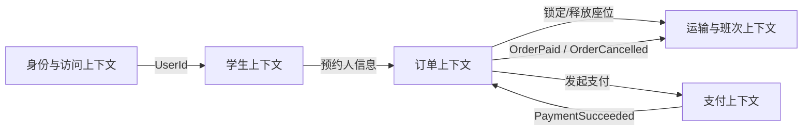
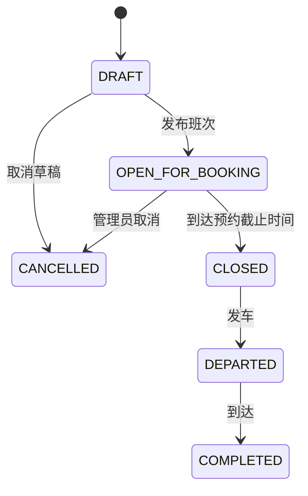
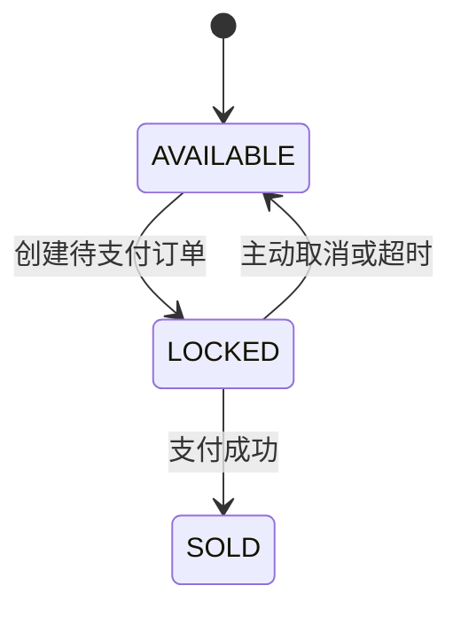
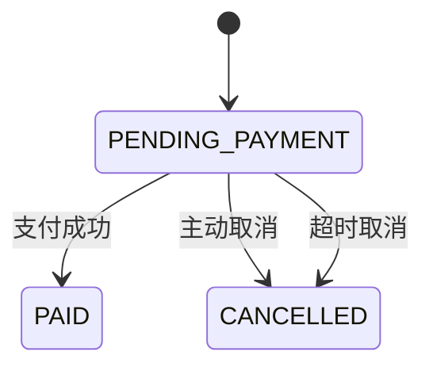
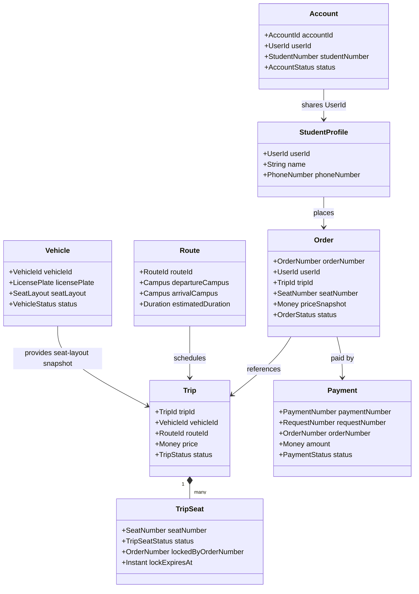

# 校园班车预约平台领域模型

> 文档版本：v0.1  
> 依赖文档：[01-requirements.md](./01-requirements.md)  
> 本阶段目标：定义领域边界、聚合、状态机、业务不变量和领域事件，暂不映射数据库表。

## 1. 建模原则

本项目采用领域驱动设计中的部分思想，但不追求复杂形式。建模遵循以下原则：

1. 先按业务职责划分领域，再考虑微服务数量。
2. 聚合边界代表事务一致性边界，不等同于数据库表或微服务。
3. 聚合内部保持强一致，跨聚合、跨服务通过应用编排和事件实现最终一致。
4. 剩余座位数、订单统计等派生数据可以缓存，但不能作为最终事实来源。
5. 状态变化必须通过明确的业务方法完成，禁止任意修改状态字段。
6. 每一项简历技术描述都必须能落到领域规则、代码和测试。

## 2. 统一领域语言

团队、代码、接口、数据库和面试讲解统一使用以下术语：

| 中文名称 | 英文名称 | 定义 |
|---|---|---|
| 学生账号 | `Account` | 用于登录、鉴权和角色判断的账号 |
| 学生档案 | `StudentProfile` | 学生的姓名、联系方式等业务资料 |
| 车辆 | `Vehicle` | 承载固定座位布局的班车 |
| 路线 | `Route` | 两个校区之间的行驶方向和预计时长 |
| 班次 | `Trip` | 某辆车在某条路线和某个时间执行的一次运输任务 |
| 班次座位 | `TripSeat` | 某个座位在特定班次中的预约状态 |
| 订单 | `Order` | 学生对某个班次座位发起的一次购买请求 |
| 支付记录 | `Payment` | 对订单执行的一次模拟支付尝试 |
| 座位锁定 | `SeatLock` | 待支付期间对班次座位的临时占用 |
| 超时取消 | `OrderExpiration` | 订单超过支付截止时间后自动取消 |

“车辆座位”和“班次座位”必须严格区分：

- 车辆座位描述车辆的静态布局，例如车辆有 `1` 至 `50` 号座位。
- 班次座位描述这些座位在某一次班次中的可预约状态。

## 3. 领域边界

### 3.1 身份与访问上下文

负责：

- 学号和密码登录。
- 密码哈希。
- 账号启用和禁用。
- 角色与权限。
- 访问令牌签发和校验。

不负责：

- 班车预约。
- 订单状态。
- 支付业务。

### 3.2 学生上下文

负责：

- 学生基本资料。
- 姓名和联系方式。
- 学生档案状态。

学生档案与登录账号共享同一个 `UserId`，但二者不是同一个聚合。

### 3.3 运输与班次上下文

负责：

- 车辆及座位布局。
- 校区间路线。
- 班次发布和生命周期。
- 班次座位库存。
- 座位锁定、确认售出和释放。

这是“不能超卖”规则的最终责任方。

### 3.4 订单上下文

负责：

- 创建订单。
- 订单价格快照。
- 支付截止时间。
- 订单状态机。
- 主动取消和超时取消。

订单只保存班次和座位的引用，不直接拥有班次座位库存。

### 3.5 支付上下文

负责：

- 模拟支付请求。
- 支付请求幂等。
- 支付结果记录。
- 发布支付成功或失败结果。

MVP 不接入真实第三方支付。

## 4. 上下文关系



约束：

- 上下文之间只能通过公开接口或事件协作。
- 一个上下文不得直接修改另一个上下文的数据。
- 拆分微服务后，不使用跨服务数据库外键。

## 5. 聚合总览

| 上下文 | 聚合根 | 内部实体/值对象 | 核心职责 |
|---|---|---|---|
| 身份与访问 | `Account` | `StudentNumber`、`PasswordHash`、`Role` | 登录标识唯一、账号状态和角色 |
| 学生 | `StudentProfile` | `UserName`、`PhoneNumber` | 学生资料 |
| 运输与班次 | `Vehicle` | `LicensePlate`、`SeatLayout` | 车辆状态和座位布局 |
| 运输与班次 | `Route` | `Campus`、`Duration` | 路线方向与预计时长 |
| 运输与班次 | `Trip` | `TripSeat`、`DepartureTime`、`Money` | 班次生命周期和座位库存 |
| 订单 | `Order` | `OrderNumber`、`OrderSeat`、`Money`、`ExpirationTime` | 订单状态与价格快照 |
| 支付 | `Payment` | `PaymentNumber`、`RequestNumber`、`Money` | 支付幂等与支付结果 |

## 6. 身份与学生模型

### 6.1 Account 聚合

聚合根字段：

- `accountId`
- `userId`
- `studentNumber`
- `passwordHash`
- `roles`
- `status`
- `createdAt`
- `updatedAt`

账号状态：

```text
ACTIVE
DISABLED
```

核心方法：

- `register(studentNumber, rawPassword)`
- `changePassword(oldPassword, newPassword)`
- `disable()`
- `enable()`
- `verifyPassword(rawPassword)`
- `hasRole(role)`

业务规则：

1. 学号全局唯一。
2. 密码只能以哈希形式保存。
3. 禁用账号不能登录。
4. 角色只能通过受控方法修改。

### 6.2 StudentProfile 聚合

聚合根字段：

- `userId`
- `name`
- `phoneNumber`
- `status`
- `createdAt`
- `updatedAt`

MVP 不保存身份证号等高敏感数据。

## 7. 车辆与路线模型

### 7.1 Vehicle 聚合

聚合根字段：

- `vehicleId`
- `licensePlate`
- `seatLayout`
- `status`
- `version`

车辆状态：

```text
ENABLED
DISABLED
```

`SeatLayout` 是值对象，包含：

- `seatCount`
- `seatNumbers`

核心方法：

- `create(licensePlate, seatLayout)`
- `changeSeatLayout(newLayout)`
- `enable()`
- `disable()`
- `containsSeat(seatNumber)`

业务规则：

1. 车牌号全局唯一。
2. 座位编号在同一车辆中唯一。
3. 座位数必须大于零。
4. 已被未来班次使用的车辆不能随意变更座位布局。
5. 停用车辆不能用于发布新班次。

### 7.2 Route 聚合

聚合根字段：

- `routeId`
- `departureCampus`
- `arrivalCampus`
- `estimatedDuration`
- `status`

业务规则：

1. 出发校区和到达校区不能相同。
2. 预计行驶时间必须大于零。
3. 停用路线不能用于发布新班次。

## 8. Trip 聚合

`Trip` 是运输与班次上下文的核心聚合根。

字段：

- `tripId`
- `vehicleId`
- `routeId`
- `departureTime`
- `bookingDeadline`
- `price`
- `status`
- `seats`
- `version`

内部实体 `TripSeat`：

- `seatNumber`
- `status`
- `lockedByOrderNumber`
- `lockedByUserId`
- `lockExpiresAt`

### 8.1 班次状态机



班次状态：

| 状态 | 含义 |
|---|---|
| `DRAFT` | 草稿，学生不可见 |
| `OPEN_FOR_BOOKING` | 已发布且允许预约 |
| `CLOSED` | 停止预约，等待发车 |
| `DEPARTED` | 已发车 |
| `COMPLETED` | 已完成 |
| `CANCELLED` | 已取消 |

### 8.2 班次座位状态机



### 8.3 Trip 核心方法

- `publish()`
- `closeBooking()`
- `depart()`
- `complete()`
- `cancel()`
- `lockSeat(seatNumber, userId, orderNumber, expiresAt)`
- `confirmSeatSold(seatNumber, orderNumber)`
- `releaseSeat(seatNumber, orderNumber)`
- `availableSeatCount()`

### 8.4 Trip 聚合不变量

1. 只有 `OPEN_FOR_BOOKING` 班次允许锁定座位。
2. 只有 `AVAILABLE` 座位允许进入 `LOCKED`。
3. 只有锁定该座位的订单才能确认售出或释放。
4. 已售座位不能直接释放。
5. 班次座位必须来自发布班次时的车辆座位布局快照。
6. 班次发车时间必须晚于当前时间和预约截止时间。
7. 价格必须大于或等于零。

## 9. Order 聚合

字段：

- `orderId`
- `orderNumber`
- `userId`
- `tripId`
- `seatNumber`
- `priceSnapshot`
- `status`
- `expiresAt`
- `paidAt`
- `cancelledAt`
- `cancelReason`
- `version`
- `createdAt`

### 9.1 订单状态机



### 9.2 Order 核心方法

- `create(userId, tripId, seatNumber, priceSnapshot, expiresAt)`
- `markPaid(paymentNumber, paidAt)`
- `cancelByUser(cancelledAt)`
- `cancelByExpiration(cancelledAt)`
- `isExpired(now)`
- `isPendingPayment()`

### 9.3 Order 聚合不变量

1. 创建订单时必须包含用户、班次、座位、价格和过期时间。
2. 价格在订单创建时形成快照，不能跟随班次价格变化。
3. 只有 `PENDING_PAYMENT` 可以转为 `PAID` 或 `CANCELLED`。
4. `PAID` 和 `CANCELLED` 为 MVP 终态。
5. 重复支付同一已支付订单时返回原结果，不重复转移状态。
6. 已取消订单不能支付。
7. 取消原因必须记录为用户取消或超时取消。

## 10. Payment 聚合

字段：

- `paymentId`
- `paymentNumber`
- `requestNumber`
- `orderNumber`
- `amount`
- `status`
- `failureReason`
- `createdAt`
- `completedAt`

支付状态：

```text
PROCESSING
SUCCEEDED
FAILED
```

核心方法：

- `create(requestNumber, orderNumber, amount)`
- `succeed(completedAt)`
- `fail(reason, completedAt)`

业务规则：

1. `requestNumber` 全局唯一，用于支付接口幂等。
2. 同一个 `requestNumber` 重复请求必须返回同一支付结果。
3. 支付金额必须与订单价格快照一致。
4. 成功或失败的支付记录不能再次改变终态。
5. 支付成功不直接修改班次座位，由支付结果驱动订单完成后续协作。

## 11. 聚合关系



## 12. 应用服务与领域服务

### 12.1 BookingApplicationService

负责创建订单用例的编排：

1. 验证用户和班次。
2. 生成订单号和支付截止时间。
3. 请求 `Trip` 锁定座位。
4. 创建 `Order`。
5. 发布订单已创建事件。

它负责流程编排，但不能绕过聚合方法直接修改状态。

在单体阶段，锁座和创建订单处于同一本地事务，任一步失败时整体回滚。拆分微服务后，如果座位已经锁定但订单创建失败，编排流程必须发送释放座位的补偿命令，不能留下孤立锁。

### 12.2 PaymentApplicationService

负责：

1. 根据 `requestNumber` 检查幂等。
2. 查询待支付订单和金额。
3. 创建或返回已有支付记录。
4. 完成模拟支付。
5. 发布支付成功事件。

### 12.3 OrderExpirationService

负责：

1. 接收订单超时事件。
2. 判断订单是否仍为待支付且确实过期。
3. 取消订单。
4. 请求班次上下文释放座位。
5. 对失败任务进行重试或补偿。

## 13. 领域事件

所有事件至少包含：

- `eventId`
- `eventType`
- `aggregateId`
- `aggregateVersion`
- `occurredAt`
- `traceId`

事件清单：

| 事件 | 产生方 | 主要消费者 | 用途 |
|---|---|---|---|
| `OrderCreated` | 订单上下文 | 超时任务 | 安排 15 分钟后检查 |
| `PaymentSucceeded` | 支付上下文 | 订单上下文 | 将订单推进为已支付 |
| `OrderPaid` | 订单上下文 | 班次上下文 | 将锁定座位确认为已售 |
| `OrderCancelled` | 订单上下文 | 班次上下文 | 释放锁定座位 |
| `TripCancelled` | 班次上下文 | 订单上下文 | 后续版本批量处理订单 |

事件处理要求：

1. 消费者以 `eventId` 或业务唯一键保证幂等。
2. 消费失败允许重试。
3. 事件顺序不能仅依赖到达时间，应结合聚合版本和当前状态判断。
4. 领域事件不能包含密码、令牌等敏感信息。

## 14. 一致性边界

### 14.1 强一致

以下操作必须在各自聚合的本地事务中完成：

- 订单状态转换。
- 支付记录状态转换。
- 班次座位锁定、售出和释放。
- 支付请求幂等记录。

### 14.2 最终一致

以下跨上下文操作允许短暂中间状态：

- 支付成功后，订单从待支付变为已支付。
- 订单已支付后，座位从锁定变为已售。
- 订单取消后，座位从锁定恢复可用。

系统必须通过消息重试和定时补偿最终收敛，不能只依赖一次远程调用。

### 14.3 并发竞争

支付和超时取消可能同时发生：

```text
支付处理线程：PENDING_PAYMENT → PAID
取消处理线程：PENDING_PAYMENT → CANCELLED
```

只有一个状态转换可以成功。最终由订单版本或条件更新保证：

```text
仅当当前状态仍为 PENDING_PAYMENT 时才允许更新
```

失败的一方读取最终状态后按幂等结果返回。

## 15. 业务不变量责任归属

| 业务不变量 | 第一责任方 | 最终保护措施 |
|---|---|---|
| 学号唯一 | `Account` | 唯一约束 |
| 车牌唯一 | `Vehicle` | 唯一约束 |
| 同一班次座位不能重复出售 | `Trip` | 班次座位条件更新/版本控制 |
| 一名学生同一班次最多一个有效订单 | `Order` | 业务校验和有效订单唯一约束 |
| 订单只能支付一次 | `Order`、`Payment` | 状态机和支付请求唯一键 |
| 订单只能有效取消一次 | `Order` | 状态条件更新 |
| 座位只能被对应订单释放 | `TripSeat` | 校验锁定订单号 |
| 剩余座位不能为负数 | `Trip` | 根据座位明细计算或受控计数更新 |

## 16. 关键建模决策

### 16.1 为什么 Seat 不是独立聚合

座位脱离车辆或班次没有独立生命周期。车辆座位属于座位布局，班次座位属于 `Trip` 聚合，因此不单独建立 `Seat` 聚合或服务。

### 16.2 为什么订单保存价格快照

班次价格可能在未来被管理员修改。订单必须保存下单时价格，否则历史订单金额会随当前班次价格变化。

### 16.3 为什么剩余座位不是最终事实

一个单独的 `remainingSeats` 数字容易在异常和并发中失真。最终事实是每个 `TripSeat` 的状态；剩余数量可以作为缓存或受控冗余字段，并且必须能够重建。

### 16.4 为什么不使用跨服务外键

数据库外键无法跨独立服务数据库工作，也会破坏服务自治。跨服务引用保存业务 ID，并通过接口、事件和补偿机制维护一致性。

### 16.5 为什么先做单体

订单创建同时涉及班次座位和订单。先在单体中用本地事务理解正确业务规则，再拆分服务并处理最终一致性，可以清楚解释微服务增加的成本，而不是一开始就用消息掩盖领域问题。

## 17. 未来微服务映射

领域模型稳定后，计划映射为：

| 微服务 | 负责的上下文 |
|---|---|
| `auth-service` | 身份与访问 |
| `user-service` | 学生档案 |
| `trip-service` | 车辆、路线、班次和座位库存 |
| `order-service` | 订单 |
| `payment-service` | 模拟支付 |
| `gateway-service` | 路由、统一认证和技术性限流，不承载业务聚合 |

第一版单体中仍按上述上下文划分代码模块，避免未来拆分时重写全部业务。

## 18. 下一阶段输入

数据库设计必须从本领域模型推导，并回答：

1. 每个聚合如何持久化。
2. 哪些字段需要唯一约束。
3. 如何用版本号或条件更新解决支付与取消竞争。
4. 如何表示一个学生同一班次只能有一个有效订单。
5. 如何保存领域事件和 Outbox 记录。
6. 哪些索引服务于班次查询、订单查询和超时扫描。
