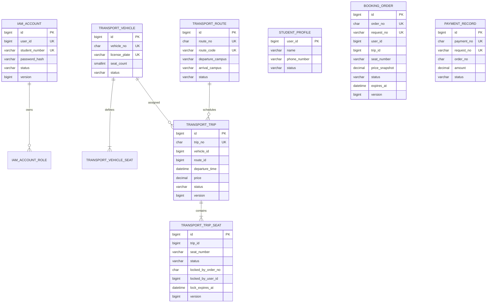

# 校园班车预约平台数据库设计

> 文档版本：v0.1  
> 依赖文档：[01-requirements.md](./01-requirements.md)、[02-domain-model.md](./02-domain-model.md)  
> 数据库：MySQL 8  
> 本阶段目标：将领域模型映射为可验证的表、约束、索引和事务方案。

## 1. 设计原则

1. 数据库约束是最终防线，不能只依赖 Java 判断、Redis 锁或前端按钮状态。
2. 聚合内部使用本地事务保持强一致，跨上下文引用不建立数据库外键。
3. 所有状态更新必须包含当前状态条件，避免并发线程互相覆盖。
4. 金额使用 `DECIMAL`，禁止使用 `FLOAT` 或 `DOUBLE`。
5. 时间统一保存为 UTC，使用 `DATETIME(3)` 保留毫秒。
6. 历史订单和支付记录不物理删除，也不使用通用 `deleted` 字段隐藏状态。
7. 内部主键和业务编号分离：内部主键用于本库关联，业务编号用于接口、事件和跨服务引用。
8. 缓存中的剩余座位数不是最终事实，必须能由 `transport_trip_seat` 重建。
9. 数据库迁移使用 Flyway，已经发布的迁移脚本不得修改。

## 2. 单体阶段与微服务阶段

### 2.1 单体阶段

第一版使用一个物理数据库：

```text
school_bus
```

通过表名前缀表达上下文边界：

```text
iam_*          身份与访问
student_*      学生档案
transport_*    车辆、路线、班次和座位
booking_*      订单
payment_*      支付
event_*        领域事件和幂等消费
```

即使处于同一个数据库，订单表也不直接外键关联学生表和班次表，避免未来拆库时形成强耦合。

### 2.2 微服务阶段

未来拆分为：

| 数据库 | 数据所有者 |
|---|---|
| `identity_db` | `auth-service` |
| `student_db` | `user-service` |
| `trip_db` | `trip-service` |
| `order_db` | `order-service` |
| `payment_db` | `payment-service` |

拆分后：

- 每个服务只能写自己的数据库。
- 跨服务不执行 SQL JOIN。
- 跨服务不建立数据库外键。
- 通过业务 ID、API 和领域事件协作。

## 3. 标识设计

### 3.1 内部主键

所有主要表使用：

```sql
id BIGINT UNSIGNED NOT NULL AUTO_INCREMENT
```

原因：

- 单库阶段实现简单。
- 聚簇索引连续，写入性能稳定。
- 内部主键不暴露给用户。
- 服务拆分后，不同服务的主键无需全局唯一。

### 3.2 业务编号

对外暴露的对象使用独立业务编号：

| 对象 | 字段 | 示例 |
|---|---|---|
| 车辆 | `vehicle_no` | UUID 字符串 |
| 路线 | `route_no` | UUID 字符串 |
| 班次 | `trip_no` | UUID 字符串 |
| 订单 | `order_no` | UUID 字符串 |
| 支付 | `payment_no` | UUID 字符串 |
| 事件 | `event_id` | UUID 字符串 |

数据库使用 `CHAR(36)` 保存标准 UUID。UUID 不作为聚簇主键，避免随机写入造成主键索引碎片。

## 4. 数据类型约定

| 数据 | 类型 | 说明 |
|---|---|---|
| 内部 ID | `BIGINT UNSIGNED` | 自增主键或本服务内部引用 |
| 业务编号 | `CHAR(36)` | UUID |
| 状态 | `VARCHAR(32)` | 配合 `CHECK` 约束 |
| 金额 | `DECIMAL(10,2)` | 精确金额 |
| 时间 | `DATETIME(3)` | UTC，毫秒精度 |
| 版本号 | `BIGINT UNSIGNED` | 乐观并发控制 |
| 事件内容 | `JSON` | Outbox 事件负载 |

状态字段不使用 MySQL `ENUM`，原因是增加新状态需要修改列定义；使用 `VARCHAR + CHECK` 更容易演进。

## 5. ER 关系概览



图中没有画出 `booking_order` 到用户、班次的物理外键，这是有意设计的跨上下文引用。

## 6. 身份与学生表

### 6.1 iam_account

```sql
CREATE TABLE iam_account (
    id              BIGINT UNSIGNED NOT NULL AUTO_INCREMENT,
    user_id         BIGINT UNSIGNED NOT NULL,
    student_number  VARCHAR(32) NOT NULL,
    password_hash   VARCHAR(255) NOT NULL,
    status          VARCHAR(16) NOT NULL,
    version         BIGINT UNSIGNED NOT NULL DEFAULT 0,
    created_at      DATETIME(3) NOT NULL,
    updated_at      DATETIME(3) NOT NULL,
    PRIMARY KEY (id),
    UNIQUE KEY uk_iam_account_user_id (user_id),
    UNIQUE KEY uk_iam_account_student_number (student_number),
    CONSTRAINT ck_iam_account_status
        CHECK (status IN ('ACTIVE', 'DISABLED'))
) ENGINE = InnoDB DEFAULT CHARSET = utf8mb4;
```

设计说明：

- `student_number` 唯一约束是防止重复账号的最终保护。
- `password_hash` 预留 255 字符，兼容 BCrypt、Argon2 等算法及后续参数升级。
- 数据库只保存哈希，不保存明文密码或可逆密文。

### 6.2 iam_account_role

```sql
CREATE TABLE iam_account_role (
    account_id  BIGINT UNSIGNED NOT NULL,
    role_code   VARCHAR(32) NOT NULL,
    created_at  DATETIME(3) NOT NULL,
    PRIMARY KEY (account_id, role_code),
    CONSTRAINT fk_iam_role_account
        FOREIGN KEY (account_id) REFERENCES iam_account (id),
    CONSTRAINT ck_iam_role_code
        CHECK (role_code IN ('STUDENT', 'ADMIN'))
) ENGINE = InnoDB DEFAULT CHARSET = utf8mb4;
```

该外键位于同一个身份上下文中，因此允许保留。

### 6.3 student_profile

```sql
CREATE TABLE student_profile (
    user_id       BIGINT UNSIGNED NOT NULL,
    name          VARCHAR(50) NOT NULL,
    phone_number  VARCHAR(20) NULL,
    status        VARCHAR(16) NOT NULL,
    version       BIGINT UNSIGNED NOT NULL DEFAULT 0,
    created_at    DATETIME(3) NOT NULL,
    updated_at    DATETIME(3) NOT NULL,
    PRIMARY KEY (user_id),
    CONSTRAINT ck_student_profile_status
        CHECK (status IN ('ACTIVE', 'DISABLED'))
) ENGINE = InnoDB DEFAULT CHARSET = utf8mb4;
```

`student_profile.user_id` 与 `iam_account.user_id` 是逻辑关联，不建立跨上下文外键。

## 7. 车辆与路线表

### 7.1 transport_vehicle

```sql
CREATE TABLE transport_vehicle (
    id             BIGINT UNSIGNED NOT NULL AUTO_INCREMENT,
    vehicle_no     CHAR(36) NOT NULL,
    license_plate  VARCHAR(20) NOT NULL,
    seat_count     SMALLINT UNSIGNED NOT NULL,
    status         VARCHAR(16) NOT NULL,
    version        BIGINT UNSIGNED NOT NULL DEFAULT 0,
    created_at     DATETIME(3) NOT NULL,
    updated_at     DATETIME(3) NOT NULL,
    PRIMARY KEY (id),
    UNIQUE KEY uk_transport_vehicle_no (vehicle_no),
    UNIQUE KEY uk_transport_vehicle_license_plate (license_plate),
    CONSTRAINT ck_transport_vehicle_seat_count
        CHECK (seat_count > 0),
    CONSTRAINT ck_transport_vehicle_status
        CHECK (status IN ('ENABLED', 'DISABLED'))
) ENGINE = InnoDB DEFAULT CHARSET = utf8mb4;
```

### 7.2 transport_vehicle_seat

```sql
CREATE TABLE transport_vehicle_seat (
    id           BIGINT UNSIGNED NOT NULL AUTO_INCREMENT,
    vehicle_id   BIGINT UNSIGNED NOT NULL,
    seat_number  VARCHAR(10) NOT NULL,
    created_at   DATETIME(3) NOT NULL,
    PRIMARY KEY (id),
    UNIQUE KEY uk_vehicle_seat_number (vehicle_id, seat_number),
    CONSTRAINT fk_vehicle_seat_vehicle
        FOREIGN KEY (vehicle_id) REFERENCES transport_vehicle (id)
) ENGINE = InnoDB DEFAULT CHARSET = utf8mb4;
```

车辆座位是座位模板。发布班次时，将其复制为 `transport_trip_seat` 快照，后续修改车辆布局不会影响已发布班次。

### 7.3 transport_route

```sql
CREATE TABLE transport_route (
    id                          BIGINT UNSIGNED NOT NULL AUTO_INCREMENT,
    route_no                    CHAR(36) NOT NULL,
    route_code                  VARCHAR(32) NOT NULL,
    departure_campus            VARCHAR(64) NOT NULL,
    arrival_campus              VARCHAR(64) NOT NULL,
    estimated_duration_minutes  SMALLINT UNSIGNED NOT NULL,
    status                      VARCHAR(16) NOT NULL,
    version                     BIGINT UNSIGNED NOT NULL DEFAULT 0,
    created_at                  DATETIME(3) NOT NULL,
    updated_at                  DATETIME(3) NOT NULL,
    PRIMARY KEY (id),
    UNIQUE KEY uk_transport_route_no (route_no),
    UNIQUE KEY uk_transport_route_code (route_code),
    KEY idx_transport_route_direction
        (departure_campus, arrival_campus, status),
    CONSTRAINT ck_transport_route_direction
        CHECK (departure_campus <> arrival_campus),
    CONSTRAINT ck_transport_route_duration
        CHECK (estimated_duration_minutes > 0),
    CONSTRAINT ck_transport_route_status
        CHECK (status IN ('ENABLED', 'DISABLED'))
) ENGINE = InnoDB DEFAULT CHARSET = utf8mb4;
```

## 8. 班次与班次座位表

### 8.1 transport_trip

```sql
CREATE TABLE transport_trip (
    id                BIGINT UNSIGNED NOT NULL AUTO_INCREMENT,
    trip_no           CHAR(36) NOT NULL,
    vehicle_id        BIGINT UNSIGNED NOT NULL,
    route_id          BIGINT UNSIGNED NOT NULL,
    departure_time    DATETIME(3) NOT NULL,
    booking_deadline  DATETIME(3) NOT NULL,
    price             DECIMAL(10,2) NOT NULL,
    status            VARCHAR(32) NOT NULL,
    version           BIGINT UNSIGNED NOT NULL DEFAULT 0,
    created_at        DATETIME(3) NOT NULL,
    updated_at        DATETIME(3) NOT NULL,
    PRIMARY KEY (id),
    UNIQUE KEY uk_transport_trip_no (trip_no),
    UNIQUE KEY uk_transport_trip_vehicle_departure
        (vehicle_id, departure_time),
    KEY idx_transport_trip_route_departure
        (route_id, departure_time, status),
    KEY idx_transport_trip_status_departure
        (status, departure_time),
    CONSTRAINT fk_transport_trip_vehicle
        FOREIGN KEY (vehicle_id) REFERENCES transport_vehicle (id),
    CONSTRAINT fk_transport_trip_route
        FOREIGN KEY (route_id) REFERENCES transport_route (id),
    CONSTRAINT ck_transport_trip_time
        CHECK (booking_deadline < departure_time),
    CONSTRAINT ck_transport_trip_price
        CHECK (price >= 0),
    CONSTRAINT ck_transport_trip_status
        CHECK (
            status IN (
                'DRAFT',
                'OPEN_FOR_BOOKING',
                'CLOSED',
                'DEPARTED',
                'COMPLETED',
                'CANCELLED'
            )
        )
) ENGINE = InnoDB DEFAULT CHARSET = utf8mb4;
```

`uk_transport_trip_vehicle_departure` 只能防止同一车辆在完全相同时间重复发车。时间区间重叠仍需应用层查询和事务控制，不能假设该唯一索引解决全部排班冲突。

### 8.2 transport_trip_seat

```sql
CREATE TABLE transport_trip_seat (
    id                    BIGINT UNSIGNED NOT NULL AUTO_INCREMENT,
    trip_id               BIGINT UNSIGNED NOT NULL,
    seat_number           VARCHAR(10) NOT NULL,
    status                VARCHAR(16) NOT NULL,
    locked_by_order_no    CHAR(36) NULL,
    locked_by_user_id     BIGINT UNSIGNED NULL,
    lock_expires_at       DATETIME(3) NULL,
    version               BIGINT UNSIGNED NOT NULL DEFAULT 0,
    created_at            DATETIME(3) NOT NULL,
    updated_at            DATETIME(3) NOT NULL,
    PRIMARY KEY (id),
    UNIQUE KEY uk_trip_seat_number (trip_id, seat_number),
    KEY idx_trip_seat_status (trip_id, status),
    KEY idx_trip_seat_locked_order (locked_by_order_no),
    KEY idx_trip_seat_expiration (status, lock_expires_at),
    CONSTRAINT fk_trip_seat_trip
        FOREIGN KEY (trip_id) REFERENCES transport_trip (id),
    CONSTRAINT ck_trip_seat_status
        CHECK (status IN ('AVAILABLE', 'LOCKED', 'SOLD'))
) ENGINE = InnoDB DEFAULT CHARSET = utf8mb4;
```

状态字段关联要求由领域逻辑保证：

| 状态 | `locked_by_order_no` | `locked_by_user_id` | `lock_expires_at` |
|---|---|---|---|
| `AVAILABLE` | `NULL` | `NULL` | `NULL` |
| `LOCKED` | 非空 | 非空 | 非空 |
| `SOLD` | 保留订单号 | 可保留 | `NULL` |

## 9. 订单表

```sql
CREATE TABLE booking_order (
    id               BIGINT UNSIGNED NOT NULL AUTO_INCREMENT,
    order_no         CHAR(36) NOT NULL,
    request_no       VARCHAR(64) NOT NULL,
    user_id          BIGINT UNSIGNED NOT NULL,
    trip_id          BIGINT UNSIGNED NOT NULL,
    seat_number      VARCHAR(10) NOT NULL,
    price_snapshot   DECIMAL(10,2) NOT NULL,
    status           VARCHAR(32) NOT NULL,
    expires_at       DATETIME(3) NOT NULL,
    payment_no       CHAR(36) NULL,
    paid_at          DATETIME(3) NULL,
    cancelled_at     DATETIME(3) NULL,
    cancel_reason    VARCHAR(32) NULL,
    version          BIGINT UNSIGNED NOT NULL DEFAULT 0,
    created_at       DATETIME(3) NOT NULL,
    updated_at       DATETIME(3) NOT NULL,
    active_marker    TINYINT
        GENERATED ALWAYS AS (
            CASE
                WHEN status IN ('PENDING_PAYMENT', 'PAID') THEN 1
                ELSE NULL
            END
        ) STORED,
    PRIMARY KEY (id),
    UNIQUE KEY uk_booking_order_no (order_no),
    UNIQUE KEY uk_booking_order_request_no (request_no),
    UNIQUE KEY uk_booking_user_trip_active
        (user_id, trip_id, active_marker),
    UNIQUE KEY uk_booking_trip_seat_active
        (trip_id, seat_number, active_marker),
    KEY idx_booking_order_user_created
        (user_id, created_at DESC),
    KEY idx_booking_order_expiration
        (status, expires_at),
    KEY idx_booking_order_trip
        (trip_id, status),
    CONSTRAINT ck_booking_order_price
        CHECK (price_snapshot >= 0),
    CONSTRAINT ck_booking_order_status
        CHECK (status IN ('PENDING_PAYMENT', 'PAID', 'CANCELLED')),
    CONSTRAINT ck_booking_order_cancel_reason
        CHECK (
            cancel_reason IS NULL
            OR cancel_reason IN ('USER_CANCELLED', 'PAYMENT_TIMEOUT')
        )
) ENGINE = InnoDB DEFAULT CHARSET = utf8mb4;
```

### 9.1 为什么使用 active_marker

MySQL 没有通用的部分唯一索引。需求要求：

- 一名学生对同一班次最多有一个未取消订单。
- 一个班次座位最多有一个未取消订单。
- 允许保留多个已经取消的历史订单。

`active_marker` 是生成列：

```text
PENDING_PAYMENT → 1
PAID            → 1
CANCELLED       → NULL
```

MySQL 唯一索引允许存在多个 `NULL`，因此：

- 有效订单只能有一个。
- 取消后的历史订单可以有多个。
- `active_marker` 由数据库生成，应用不能忘记同步更新。

### 9.2 为什么订单没有用户和班次外键

`user_id`、`trip_id` 是跨上下文引用。单体阶段也不建立外键，确保未来拆分数据库时不依赖跨服务级联操作。

## 10. 支付表

```sql
CREATE TABLE payment_record (
    id               BIGINT UNSIGNED NOT NULL AUTO_INCREMENT,
    payment_no       CHAR(36) NOT NULL,
    request_no       VARCHAR(64) NOT NULL,
    order_no         CHAR(36) NOT NULL,
    amount           DECIMAL(10,2) NOT NULL,
    status           VARCHAR(16) NOT NULL,
    failure_reason   VARCHAR(255) NULL,
    completed_at     DATETIME(3) NULL,
    version          BIGINT UNSIGNED NOT NULL DEFAULT 0,
    created_at       DATETIME(3) NOT NULL,
    updated_at       DATETIME(3) NOT NULL,
    success_marker   TINYINT
        GENERATED ALWAYS AS (
            CASE WHEN status = 'SUCCEEDED' THEN 1 ELSE NULL END
        ) STORED,
    PRIMARY KEY (id),
    UNIQUE KEY uk_payment_no (payment_no),
    UNIQUE KEY uk_payment_request_no (request_no),
    UNIQUE KEY uk_payment_order_success
        (order_no, success_marker),
    KEY idx_payment_order_status (order_no, status),
    CONSTRAINT ck_payment_amount
        CHECK (amount >= 0),
    CONSTRAINT ck_payment_status
        CHECK (status IN ('PROCESSING', 'SUCCEEDED', 'FAILED'))
) ENGINE = InnoDB DEFAULT CHARSET = utf8mb4;
```

幂等保护：

- `request_no` 保证同一个支付请求只创建一条支付记录。
- `uk_payment_order_success` 保证同一订单最多只有一条成功支付记录。
- 失败后可以使用新的 `request_no` 再次尝试。

## 11. Outbox 与消息消费幂等表

### 11.1 event_outbox

```sql
CREATE TABLE event_outbox (
    id                 BIGINT UNSIGNED NOT NULL AUTO_INCREMENT,
    event_id           CHAR(36) NOT NULL,
    context_name       VARCHAR(32) NOT NULL,
    aggregate_type     VARCHAR(64) NOT NULL,
    aggregate_id       VARCHAR(64) NOT NULL,
    aggregate_version  BIGINT UNSIGNED NOT NULL,
    event_type         VARCHAR(64) NOT NULL,
    payload            JSON NOT NULL,
    trace_id           VARCHAR(64) NULL,
    status             VARCHAR(16) NOT NULL,
    retry_count        INT UNSIGNED NOT NULL DEFAULT 0,
    next_retry_at      DATETIME(3) NULL,
    occurred_at        DATETIME(3) NOT NULL,
    created_at         DATETIME(3) NOT NULL,
    published_at       DATETIME(3) NULL,
    version            BIGINT UNSIGNED NOT NULL DEFAULT 0,
    PRIMARY KEY (id),
    UNIQUE KEY uk_event_outbox_event_id (event_id),
    KEY idx_event_outbox_publish
        (status, next_retry_at, id),
    KEY idx_event_outbox_aggregate
        (aggregate_type, aggregate_id, aggregate_version),
    CONSTRAINT ck_event_outbox_status
        CHECK (status IN ('NEW', 'PUBLISHED', 'FAILED'))
) ENGINE = InnoDB DEFAULT CHARSET = utf8mb4;
```

业务数据变更和 Outbox 事件插入必须处于同一本地事务：

```text
更新订单状态
写入 event_outbox
提交事务
```

提交后由后台发布器将事件发送到 RocketMQ。这样可以避免“数据库提交成功但消息发送失败”造成事件永久丢失。

### 11.2 event_consumed

```sql
CREATE TABLE event_consumed (
    consumer_name  VARCHAR(64) NOT NULL,
    event_id       CHAR(36) NOT NULL,
    consumed_at    DATETIME(3) NOT NULL,
    PRIMARY KEY (consumer_name, event_id)
) ENGINE = InnoDB DEFAULT CHARSET = utf8mb4;
```

消费者在本地事务中先插入消费记录：

```text
插入 event_consumed
执行本地业务更新
提交事务
```

如果相同事件再次到达，主键冲突表示已经消费，消费者直接返回成功。

## 12. 防超卖设计

### 12.1 错误做法

以下流程存在竞态条件：

```text
SELECT status FROM transport_trip_seat
判断 AVAILABLE
UPDATE status = LOCKED
```

两个线程可能同时读到 `AVAILABLE`，随后都认为自己锁座成功。

Redis 分布式锁也不能作为最终保护，因为 Redis 可能超时、主从切换或锁提前过期。

### 12.2 正确的条件更新

锁座使用单条原子 SQL：

```sql
UPDATE transport_trip_seat
SET
    status = 'LOCKED',
    locked_by_order_no = :orderNo,
    locked_by_user_id = :userId,
    lock_expires_at = :expiresAt,
    version = version + 1,
    updated_at = :now
WHERE trip_id = :tripId
  AND seat_number = :seatNumber
  AND status = 'AVAILABLE';
```

判断：

```text
影响行数 = 1 → 锁座成功
影响行数 = 0 → 座位不存在或已被占用
```

数据库唯一约束 `uk_booking_trip_seat_active` 再提供第二层保护。

### 12.3 创建订单事务顺序

单体阶段使用同一本地事务：

```text
1. 根据 request_no 查询是否为重复请求
2. 条件更新 transport_trip_seat，锁定座位
3. 插入 booking_order
4. 插入 OrderCreated Outbox 事件
5. 提交事务
```

如果步骤 3 或步骤 4 失败，整个事务回滚，座位恢复为 `AVAILABLE`。

未来拆分微服务后，步骤 2 与步骤 3 不再处于同一本地事务，需要 Saga 编排和释放座位补偿。

## 13. 支付与超时取消竞争

支付和超时取消可能同时更新同一订单。

### 13.1 支付状态更新

```sql
UPDATE booking_order
SET
    status = 'PAID',
    payment_no = :paymentNo,
    paid_at = :paidAt,
    version = version + 1,
    updated_at = :now
WHERE order_no = :orderNo
  AND status = 'PENDING_PAYMENT'
  AND expires_at > :paidAt;
```

### 13.2 超时取消状态更新

```sql
UPDATE booking_order
SET
    status = 'CANCELLED',
    cancel_reason = 'PAYMENT_TIMEOUT',
    cancelled_at = :cancelledAt,
    version = version + 1,
    updated_at = :now
WHERE order_no = :orderNo
  AND status = 'PENDING_PAYMENT'
  AND expires_at <= :cancelledAt;
```

两条 SQL 都要求当前状态为 `PENDING_PAYMENT`，因此只有一个更新可以成功。

边界规则：

- 支付完成时间严格早于 `expires_at`，支付可以成功。
- 支付完成时间等于或晚于 `expires_at`，按超时处理。
- 失败的一方重新查询订单并按最终状态幂等返回。

## 14. 座位确认与释放

### 14.1 支付后确认售出

```sql
UPDATE transport_trip_seat
SET
    status = 'SOLD',
    lock_expires_at = NULL,
    version = version + 1,
    updated_at = :now
WHERE trip_id = :tripId
  AND seat_number = :seatNumber
  AND status = 'LOCKED'
  AND locked_by_order_no = :orderNo;
```

### 14.2 取消后释放座位

```sql
UPDATE transport_trip_seat
SET
    status = 'AVAILABLE',
    locked_by_order_no = NULL,
    locked_by_user_id = NULL,
    lock_expires_at = NULL,
    version = version + 1,
    updated_at = :now
WHERE trip_id = :tripId
  AND seat_number = :seatNumber
  AND status = 'LOCKED'
  AND locked_by_order_no = :orderNo;
```

`locked_by_order_no = :orderNo` 防止旧订单或重复消息释放其他订单持有的座位。

## 15. 超时补偿查询

即使 RocketMQ 延迟消息丢失或消费持续失败，定时补偿任务仍可扫描：

```sql
SELECT id, order_no
FROM booking_order
WHERE status = 'PENDING_PAYMENT'
  AND expires_at <= :now
ORDER BY expires_at, id
LIMIT :batchSize;
```

该查询使用：

```text
idx_booking_order_expiration(status, expires_at)
```

补偿任务仍使用条件更新取消订单，不能查询后直接无条件覆盖状态。

如果部署多个补偿实例，可使用：

```sql
SELECT id, order_no
FROM booking_order
WHERE status = 'PENDING_PAYMENT'
  AND expires_at <= :now
ORDER BY expires_at, id
LIMIT :batchSize
FOR UPDATE SKIP LOCKED;
```

## 16. 事务与隔离级别

### 16.1 推荐隔离级别

预约相关事务优先使用 `READ COMMITTED`，并依赖：

- 唯一约束。
- 原子条件更新。
- 明确的状态机。
- 必要时的行锁。

不依赖“先查询后判断”实现并发安全。

### 16.2 统一加锁顺序

不同用例必须明确并固定自己的加锁顺序：

```text
创建订单：班次座位 → 插入新订单 → Outbox
支付/取消：已有订单 → 该订单持有的班次座位 → Outbox
```

创建订单时插入的是新订单，不会与其他事务争抢已有订单行。支付和取消都先竞争同一订单行，胜者再更新该订单持有的座位；禁止新增“先锁已有座位、再锁已有订单”的反向流程。这样既与状态竞争 SQL 一致，也能降低交叉死锁概率。

### 16.3 死锁处理

- 事务保持短小，事务中不执行远程调用。
- 捕获 MySQL 死锁异常。
- 只对幂等操作进行有限次数重试。
- 日志记录订单号、班次和座位，便于定位。

## 17. 索引清单与服务查询

| 索引 | 主要用途 |
|---|---|
| `uk_iam_account_student_number` | 注册和登录 |
| `uk_transport_vehicle_no` | API 按车辆业务编号定位 |
| `uk_transport_vehicle_license_plate` | 车辆唯一性 |
| `uk_transport_route_no` | API 按路线业务编号定位 |
| `idx_transport_trip_route_departure` | 按路线和日期查询班次 |
| `idx_transport_trip_status_departure` | 查询可预约班次 |
| `uk_trip_seat_number` | 精确定位班次座位 |
| `idx_trip_seat_status` | 统计可用座位 |
| `idx_trip_seat_expiration` | 扫描异常过期锁 |
| `uk_booking_order_request_no` | 创建订单接口幂等 |
| `uk_booking_user_trip_active` | 同一学生同一班次限购 |
| `uk_booking_trip_seat_active` | 订单层防重复占座 |
| `idx_booking_order_user_created` | 学生订单列表 |
| `idx_booking_order_expiration` | 超时订单扫描 |
| `uk_payment_request_no` | 支付接口幂等 |
| `uk_payment_order_success` | 一个订单最多一次成功支付 |
| `idx_event_outbox_publish` | 扫描待发布事件 |

索引是否有效必须通过 `EXPLAIN ANALYZE` 验证，不能仅凭字段名称判断。

## 18. 数据一致性校验 SQL

### 18.1 查找重复有效座位订单

```sql
SELECT trip_id, seat_number, COUNT(*) AS order_count
FROM booking_order
WHERE status IN ('PENDING_PAYMENT', 'PAID')
GROUP BY trip_id, seat_number
HAVING COUNT(*) > 1;
```

结果必须为空。

### 18.2 查找重复学生班次订单

```sql
SELECT user_id, trip_id, COUNT(*) AS order_count
FROM booking_order
WHERE status IN ('PENDING_PAYMENT', 'PAID')
GROUP BY user_id, trip_id
HAVING COUNT(*) > 1;
```

结果必须为空。

### 18.3 查找订单和座位状态不匹配

```sql
SELECT
    o.order_no,
    o.status AS order_status,
    s.status AS seat_status
FROM booking_order o
JOIN transport_trip_seat s
  ON s.trip_id = o.trip_id
 AND s.seat_number = o.seat_number
WHERE
    (o.status = 'PAID' AND s.status <> 'SOLD')
    OR
    (
        o.status = 'PENDING_PAYMENT'
        AND (
            s.status <> 'LOCKED'
            OR s.locked_by_order_no <> o.order_no
        )
    );
```

单体强一致阶段结果必须为空；微服务最终一致阶段允许短暂出现，但必须能够自动收敛。

## 19. Flyway 迁移规划

建议迁移文件：

```text
db/migration/
├── V1__create_identity_tables.sql
├── V2__create_student_tables.sql
├── V3__create_transport_tables.sql
├── V4__create_booking_tables.sql
├── V5__create_payment_tables.sql
├── V6__create_event_tables.sql
└── V7__insert_local_demo_data.sql
```

规则：

1. 已经在共享环境执行的迁移不得修改。
2. 表结构调整必须新增迁移。
3. 测试数据和生产结构迁移分离。
4. 应用账号不使用 MySQL `root`。
5. 日志不得输出数据库密码。

## 20. 面试解释要点

### 为什么 Redis 锁不能单独防超卖？

Redis 锁属于性能优化和请求协调手段。锁可能超时、误释放或在故障切换时短暂失效，因此数据库条件更新和唯一约束必须作为最终保护。

### 为什么不用一个库存数字直接减一？

本业务是选具体座位，不只是总量库存。座位状态才是最终事实；单独库存数字无法说明具体哪个座位被占用，也更容易在异常流程中失真。

### 为什么使用生成列实现有效订单唯一？

MySQL 没有通用部分唯一索引。生成列把有效状态映射为 `1`、取消状态映射为 `NULL`，利用唯一索引允许多个 `NULL` 的特性，在保留历史订单的同时约束有效订单。

### 为什么支付和取消不能先查再更新？

查询结果可能在下一条 SQL 执行前被其他事务修改。条件更新将“判断当前状态”和“更新状态”合并为一个原子操作，以影响行数判断谁赢得竞争。

### 为什么需要 Outbox？

直接执行“提交数据库后发送 MQ”存在中间故障窗口。Outbox 将业务更新和待发送事件放入同一个本地事务，再异步发送，确保消息不会因为进程崩溃而永久丢失。

## 21. 可执行验证记录

2026-07-30 使用 MySQL 8.0.36 对本文设计进行了临时数据库验证：

| 验证项 | 结果 |
|---|---|
| 12 张表的 DDL 顺序执行 | 全部创建成功 |
| 同一座位第一次条件锁定 | 影响 1 行 |
| 同一座位第二次条件锁定 | 影响 0 行 |
| 支付先成功后执行超时取消 | 支付影响 1 行，取消影响 0 行 |
| 超时取消先成功后执行支付 | 取消影响 1 行，支付影响 0 行 |
| 临时验证数据库 | 验证后已删除 |

这组验证证明条件更新可以在数据库层正确阻止重复锁座和订单状态覆盖。后续编码阶段仍需增加多线程集成测试，验证真实事务边界、死锁重试和幂等返回。

API 设计阶段补充 `vehicle_no`、`route_no` 后，12 张表的 DDL 和两个新增唯一索引已再次在 MySQL 8.0.36 中执行通过。

## 22. 下一阶段输入

下一阶段进行 API 设计，必须根据本数据库设计明确：

1. 创建订单接口如何传递 `request_no`。
2. 支付接口如何传递支付幂等键。
3. 状态竞争失败时返回什么业务错误码。
4. 列表查询如何分页。
5. API 是否暴露内部数据库主键。
6. 取消和支付接口的重复调用如何返回稳定结果。
