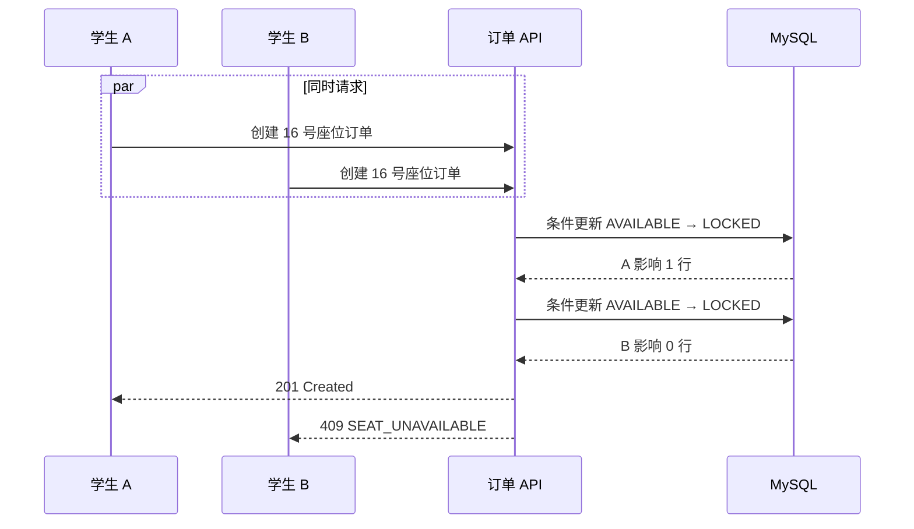

# 校园班车预约平台 API 设计

版本：1.0  
状态：MVP 接口基线  
技术方向：Spring Boot 3、Spring Security、JWT、MySQL 8

## 1. 设计目标

本接口设计服务于三个目标：

1. 覆盖“注册、登录、查班次、选座、下单、模拟支付、取消、查订单”的完整学生流程。
2. 明确幂等、并发竞争和状态冲突的外部表现，避免控制器自行决定业务语义。
3. 不暴露数据库结构，使单体应用未来拆分微服务时尽量保持客户端契约稳定。

API 只负责传输协议和用例入口。控制器不得直接操作 Repository 或拼接业务状态，必须调用应用服务。

## 2. 基础约定

### 2.1 基础路径

```text
/api/v1
```

学生接口：

```text
/api/v1/auth/**
/api/v1/trips/**
/api/v1/orders/**
```

管理员接口：

```text
/api/v1/admin/**
```

### 2.2 数据格式

- 请求和响应使用 `application/json`。
- 字符编码使用 UTF-8。
- JSON 字段使用 `lowerCamelCase`。
- 金额使用 JSON 数字和两位小数，不使用浮点数进行服务端计算。
- 时间使用 ISO 8601 UTC 格式，例如 `2026-08-01T02:00:00.000Z`。
- 数据库存储的 `DATETIME(3)` 统一按 UTC 解释。
- 学校业务时区配置为 `Asia/Shanghai`；`departureDate` 等自然日筛选先按该时区确定范围，再转换为 UTC 查询。
- 枚举值使用大写英文，例如 `PENDING_PAYMENT`。

### 2.3 对外标识

API 不暴露数据库自增主键。

| 对象 | API 字段 | 格式 |
|---|---|---|
| 用户 | `userId` | 字符串形式的业务标识 |
| 车辆 | `vehicleNo` | UUID |
| 路线 | `routeNo` | UUID |
| 班次 | `tripNo` | UUID |
| 订单 | `orderNo` | UUID |
| 支付 | `paymentNo` | UUID |

`routeCode` 和 `licensePlate` 是业务属性，不代替稳定的资源编号。

### 2.4 HTTP 方法

| 方法 | 用途 |
|---|---|
| `GET` | 查询资源，不改变业务状态 |
| `POST` | 创建资源或执行带有业务含义的命令 |
| `PUT` | 完整修改管理员维护的资源 |

MVP 不提供物理删除接口。车辆、路线和班次通过状态转换停用或取消。

## 3. 通用请求头

### 3.1 Authorization

除注册和登录外，业务接口必须携带：

```http
Authorization: Bearer <access-token>
```

### 3.2 Idempotency-Key

创建订单和模拟支付必须携带：

```http
Idempotency-Key: 550e8400-e29b-41d4-a716-446655440000
```

规则：

- 推荐使用 UUID。
- 最大长度 64 个字符。
- 数据库存入 `request_no`。
- 同一键、同一用户、同一接口、同一请求内容，返回同一业务结果。
- 同一键对应不同请求内容，返回 `IDEMPOTENCY_KEY_REUSED`。
- 不允许客户端用一个固定键处理多次不同下单或支付操作。

### 3.3 请求追踪

客户端可以传递：

```http
X-Request-Id: 7dcd20ec-44d6-46c9-a868-ae361460ea43
```

服务端规则：

1. 合法且未重复的请求 ID 可以继续使用。
2. 缺失或非法时由服务端生成。
3. 响应头返回 `X-Request-Id`。
4. 日志、Outbox 事件和错误响应使用同一个 `traceId`。

客户端不能通过请求体传递 `userId` 冒充其他用户。学生身份只能从 JWT 中取得。

## 4. 统一响应

### 4.1 成功响应

```json
{
  "code": "OK",
  "message": "success",
  "data": {
    "orderNo": "bb5ee29c-c945-4d46-a626-cfe0f64df3bc"
  },
  "traceId": "7dcd20ec-44d6-46c9-a868-ae361460ea43",
  "timestamp": "2026-08-01T01:00:00.000Z"
}
```

业务数据统一放入 `data`。控制器不能返回数据库实体。

### 4.2 错误响应

```json
{
  "code": "SEAT_UNAVAILABLE",
  "message": "座位已被占用，请选择其他座位",
  "details": [
    {
      "field": "seatNumber",
      "reason": "unavailable"
    }
  ],
  "traceId": "7dcd20ec-44d6-46c9-a868-ae361460ea43",
  "timestamp": "2026-08-01T01:00:00.000Z"
}
```

生产环境不得返回：

- Java 异常类名。
- 堆栈信息。
- SQL 语句。
- 表名和字段名。
- 令牌、密码哈希或内部服务地址。

### 4.3 分页响应

分页参数：

```text
page=0
size=20
sort=departureTime,asc
```

约束：

- `page` 从 0 开始。
- `size` 默认 20，最小 1，最大 100。
- `sort` 只允许接口声明的字段，禁止直接拼接到 SQL。

响应：

```json
{
  "code": "OK",
  "message": "success",
  "data": {
    "items": [],
    "page": 0,
    "size": 20,
    "totalElements": 0,
    "totalPages": 0
  },
  "traceId": "7dcd20ec-44d6-46c9-a868-ae361460ea43",
  "timestamp": "2026-08-01T01:00:00.000Z"
}
```

## 5. HTTP 状态码

| HTTP 状态 | 使用场景 |
|---|---|
| `200 OK` | 查询、支付、取消和状态命令成功 |
| `201 Created` | 注册、创建订单或管理员创建资源成功 |
| `400 Bad Request` | JSON、字段格式或必要请求头错误 |
| `401 Unauthorized` | 未登录、令牌无效或令牌过期 |
| `403 Forbidden` | 已登录但角色或资源权限不足 |
| `404 Not Found` | 资源不存在，或当前用户无权获知资源存在 |
| `409 Conflict` | 唯一性冲突、座位竞争失败或状态冲突 |
| `422 Unprocessable Content` | 请求格式正确但金额等业务参数不成立 |
| `429 Too Many Requests` | 触发接口限流 |
| `500 Internal Server Error` | 未预期的服务端错误 |
| `503 Service Unavailable` | 必要依赖暂时不可用 |

不要用 `200` 包装所有错误。HTTP 状态表达协议结果，`code` 表达稳定的业务原因。

## 6. 错误码

### 6.1 通用错误

| 错误码 | HTTP | 含义 |
|---|---:|---|
| `VALIDATION_ERROR` | 400 | 字段校验失败 |
| `MALFORMED_JSON` | 400 | JSON 无法解析 |
| `IDEMPOTENCY_KEY_REQUIRED` | 400 | 缺少幂等键 |
| `INVALID_IDEMPOTENCY_KEY` | 400 | 幂等键格式或长度错误 |
| `UNAUTHENTICATED` | 401 | 未提供有效身份 |
| `TOKEN_EXPIRED` | 401 | 访问令牌已过期 |
| `FORBIDDEN` | 403 | 角色权限不足 |
| `RESOURCE_NOT_FOUND` | 404 | 资源不存在 |
| `IDEMPOTENCY_KEY_REUSED` | 409 | 相同幂等键用于不同请求 |
| `DUPLICATE_RESOURCE` | 409 | 唯一业务字段重复 |
| `VERSION_CONFLICT` | 409 | 管理员更新的版本已过期 |
| `RATE_LIMITED` | 429 | 请求过于频繁 |
| `INTERNAL_ERROR` | 500 | 未预期错误 |
| `DEPENDENCY_UNAVAILABLE` | 503 | 必要依赖不可用 |

### 6.2 认证与账户错误

| 错误码 | HTTP | 含义 |
|---|---:|---|
| `STUDENT_NUMBER_ALREADY_REGISTERED` | 409 | 学号已注册 |
| `INVALID_CREDENTIALS` | 401 | 学号或密码错误 |
| `ACCOUNT_DISABLED` | 403 | 账号已停用 |

登录失败统一使用 `INVALID_CREDENTIALS`，不暴露是学号不存在还是密码错误。

### 6.3 预约和订单错误

| 错误码 | HTTP | 含义 |
|---|---:|---|
| `TRIP_NOT_BOOKABLE` | 409 | 班次未开放、已截止或已取消 |
| `SEAT_NOT_FOUND` | 404 | 班次中不存在该座位 |
| `SEAT_UNAVAILABLE` | 409 | 座位已锁定或已售 |
| `ACTIVE_ORDER_EXISTS` | 409 | 当前学生已有该班次的有效订单 |
| `ORDER_NOT_PAYABLE` | 409 | 订单不是可支付状态 |
| `ORDER_ALREADY_CANCELLED` | 409 | 已取消订单不能支付 |
| `ORDER_NOT_CANCELLABLE` | 409 | 订单不是可取消状态 |
| `PAYMENT_AMOUNT_MISMATCH` | 422 | 支付金额与订单快照不一致 |
| `PAYMENT_REQUEST_FAILED` | 409 | 模拟支付请求已失败 |

### 6.4 管理端错误

| 错误码 | HTTP | 含义 |
|---|---:|---|
| `LICENSE_PLATE_ALREADY_EXISTS` | 409 | 车牌号重复 |
| `ROUTE_CODE_ALREADY_EXISTS` | 409 | 路线编码重复 |
| `VEHICLE_DISABLED` | 409 | 停用车辆不能发布班次 |
| `ROUTE_DISABLED` | 409 | 停用路线不能发布班次 |
| `VEHICLE_SCHEDULE_CONFLICT` | 409 | 车辆排班时间重叠 |
| `TRIP_NOT_EDITABLE` | 409 | 当前班次状态不允许修改 |
| `TRIP_NOT_PUBLISHABLE` | 409 | 当前班次不满足发布条件 |

## 7. JWT 与权限

### 7.1 登录令牌

MVP 登录成功后签发短期 Access Token：

```json
{
  "sub": "1000001",
  "roles": ["STUDENT"],
  "jti": "d7fa3eb4-f4a8-4a93-9ab6-bde9e0aa2ae6",
  "iat": 1785546000,
  "exp": 1785553200
}
```

建议有效期为 2 小时。JWT 只保存身份和授权所需的最少信息，不放置姓名、手机号等可变资料。

### 7.2 权限规则

| 路径 | 允许角色 |
|---|---|
| `/api/v1/auth/register` | 匿名 |
| `/api/v1/auth/login` | 匿名 |
| `/api/v1/trips/**` | `STUDENT`、`ADMIN` |
| `/api/v1/orders/**` | `STUDENT` |
| `/api/v1/admin/**` | `ADMIN` |

订单详情、支付和取消还需要对象级权限：只能操作 JWT 当前用户自己的订单。对其他学生的订单统一返回 `404`，避免泄露订单是否存在。

## 8. 认证接口

### 8.1 学生注册

```http
POST /api/v1/auth/register
```

请求：

```json
{
  "studentNumber": "20260001",
  "password": "StrongPass!2026",
  "name": "张三",
  "phoneNumber": "13800138000"
}
```

校验：

- `studentNumber`：1 至 32 个字符，只允许学校定义的学号格式。
- `password`：8 至 72 个字符。
- `name`：1 至 50 个字符。
- `phoneNumber`：可选，最大 20 个字符。

成功：`201 Created`

```json
{
  "code": "OK",
  "message": "success",
  "data": {
    "userId": "1000001",
    "studentNumber": "20260001",
    "name": "张三",
    "status": "ACTIVE"
  },
  "traceId": "03cf7cf4-3e02-4688-929c-b1f83d84d72b",
  "timestamp": "2026-08-01T01:00:00.000Z"
}
```

### 8.2 登录

```http
POST /api/v1/auth/login
```

请求：

```json
{
  "studentNumber": "20260001",
  "password": "StrongPass!2026"
}
```

成功：`200 OK`

```json
{
  "code": "OK",
  "message": "success",
  "data": {
    "accessToken": "<jwt>",
    "tokenType": "Bearer",
    "expiresIn": 7200,
    "user": {
      "userId": "1000001",
      "studentNumber": "20260001",
      "name": "张三",
      "roles": ["STUDENT"]
    }
  },
  "traceId": "03cf7cf4-3e02-4688-929c-b1f83d84d72b",
  "timestamp": "2026-08-01T01:00:00.000Z"
}
```

MVP 暂不提供 Refresh Token。后续增加时应使用独立的可撤销令牌机制，不能简单签发永久 JWT。

## 9. 学生班次接口

### 9.1 查询可预约班次

```http
GET /api/v1/trips
```

查询参数：

| 参数 | 必填 | 说明 |
|---|---|---|
| `departureCampus` | 否 | 出发校区精确匹配 |
| `arrivalCampus` | 否 | 到达校区精确匹配 |
| `departureDate` | 否 | 按业务时区日期查询，格式 `yyyy-MM-dd` |
| `page` | 否 | 默认 0 |
| `size` | 否 | 默认 20，最大 100 |
| `sort` | 否 | 允许 `departureTime,asc` 或 `departureTime,desc` |

只返回：

- `OPEN_FOR_BOOKING`。
- 未超过 `bookingDeadline`。
- 尚未发车。

列表项：

```json
{
  "tripNo": "cb82ebec-cce5-4a17-ab7f-121561ab96ca",
  "departureCampus": "东校区",
  "arrivalCampus": "西校区",
  "departureTime": "2026-08-01T02:00:00.000Z",
  "bookingDeadline": "2026-08-01T01:30:00.000Z",
  "estimatedArrivalTime": "2026-08-01T02:40:00.000Z",
  "price": 5.00,
  "availableSeatCount": 37,
  "status": "OPEN_FOR_BOOKING"
}
```

`availableSeatCount` 是展示值，最终能否下单仍以锁座条件更新为准。

### 9.2 查询班次详情

```http
GET /api/v1/trips/{tripNo}
```

返回路线、发车时间、预约截止时间、票价、车辆展示信息和可用座位数。

### 9.3 查询座位图

```http
GET /api/v1/trips/{tripNo}/seats
```

成功数据：

```json
{
  "tripNo": "cb82ebec-cce5-4a17-ab7f-121561ab96ca",
  "bookingDeadline": "2026-08-01T01:30:00.000Z",
  "seats": [
    {
      "seatNumber": "1",
      "status": "AVAILABLE"
    },
    {
      "seatNumber": "2",
      "status": "LOCKED"
    },
    {
      "seatNumber": "3",
      "status": "SOLD"
    }
  ]
}
```

接口不能返回占座学生、订单号或锁过期时间，避免泄露其他用户信息。

## 10. 学生订单接口

### 10.1 创建订单

```http
POST /api/v1/orders
Authorization: Bearer <access-token>
Idempotency-Key: 550e8400-e29b-41d4-a716-446655440000
```

请求：

```json
{
  "tripNo": "cb82ebec-cce5-4a17-ab7f-121561ab96ca",
  "seatNumber": "16"
}
```

服务端不能接受客户端传递：

- `userId`
- `orderNo`
- `price`
- `status`
- `expiresAt`

这些值由认证身份、班次当前数据和服务端规则产生，其中订单金额保存为价格快照。

成功：`201 Created`

响应头：

```http
Location: /api/v1/orders/bb5ee29c-c945-4d46-a626-cfe0f64df3bc
Idempotency-Replayed: false
```

成功数据：

```json
{
  "orderNo": "bb5ee29c-c945-4d46-a626-cfe0f64df3bc",
  "tripNo": "cb82ebec-cce5-4a17-ab7f-121561ab96ca",
  "seatNumber": "16",
  "amount": 5.00,
  "status": "PENDING_PAYMENT",
  "createdAt": "2026-08-01T01:00:00.000Z",
  "expiresAt": "2026-08-01T01:15:00.000Z"
}
```

相同幂等键和相同请求重试时：

- 仍返回 `201 Created` 和相同 `Location`。
- 返回同一个 `orderNo` 和原始订单数据。
- 响应头为 `Idempotency-Replayed: true`。
- 不重新锁座、不延长支付截止时间。

### 10.2 查询我的订单

```http
GET /api/v1/orders
```

参数：

| 参数 | 必填 | 说明 |
|---|---|---|
| `status` | 否 | `PENDING_PAYMENT`、`PAID` 或 `CANCELLED` |
| `page` | 否 | 默认 0 |
| `size` | 否 | 默认 20，最大 100 |
| `sort` | 否 | 允许 `createdAt,asc`、`createdAt,desc` |

`userId` 必须来自 JWT，不能作为查询参数。

### 10.3 查询订单详情

```http
GET /api/v1/orders/{orderNo}
```

成功数据：

```json
{
  "orderNo": "bb5ee29c-c945-4d46-a626-cfe0f64df3bc",
  "trip": {
    "tripNo": "cb82ebec-cce5-4a17-ab7f-121561ab96ca",
    "departureCampus": "东校区",
    "arrivalCampus": "西校区",
    "departureTime": "2026-08-01T02:00:00.000Z"
  },
  "seatNumber": "16",
  "amount": 5.00,
  "status": "PENDING_PAYMENT",
  "expiresAt": "2026-08-01T01:15:00.000Z",
  "paidAt": null,
  "cancelledAt": null,
  "cancelReason": null,
  "createdAt": "2026-08-01T01:00:00.000Z"
}
```

订单金额使用创建时的价格快照。MVP 的行程信息通过班次查询投影获得；如果后续允许修改已发布班次或物理删除路线，应再为订单增加出发校区、到达校区和发车时间快照。

### 10.4 主动取消订单

```http
POST /api/v1/orders/{orderNo}/cancellation
Authorization: Bearer <access-token>
```

请求体为空，或发送：

```json
{}
```

成功：`200 OK`

```json
{
  "orderNo": "bb5ee29c-c945-4d46-a626-cfe0f64df3bc",
  "status": "CANCELLED",
  "cancelReason": "USER_CANCELLED",
  "cancelledAt": "2026-08-01T01:05:00.000Z"
}
```

幂等规则：

- 第一次取消待支付订单：取消订单并释放座位。
- 重复取消已取消订单：返回当前取消结果，不重复释放座位。
- 已支付订单：返回 `ORDER_NOT_CANCELLABLE`。
- 超时任务先取消：返回当前 `CANCELLED` 结果，保留 `PAYMENT_TIMEOUT` 原因。

该接口依靠订单状态自然幂等，不要求 `Idempotency-Key`。

## 11. 模拟支付接口

### 11.1 支付订单

```http
POST /api/v1/orders/{orderNo}/payments
Authorization: Bearer <access-token>
Idempotency-Key: c583311f-e94c-4cd0-a357-a4a340181038
```

请求：

```json
{
  "amount": 5.00
}
```

成功：`200 OK`

```json
{
  "paymentNo": "35137148-d86d-43a8-bd62-05f7f128d117",
  "orderNo": "bb5ee29c-c945-4d46-a626-cfe0f64df3bc",
  "amount": 5.00,
  "paymentStatus": "SUCCEEDED",
  "orderStatus": "PAID",
  "completedAt": "2026-08-01T01:05:00.000Z"
}
```

说明：

- 这是模拟支付，不接入真实第三方渠道。
- 金额来自客户端是为了演示金额校验，最终必须与订单价格快照比较。
- 客户端不能指定“支付成功时间”或订单目标状态。

幂等规则：

1. 相同幂等键和相同请求返回同一支付记录。
2. 相同幂等键但金额或订单不同，返回 `IDEMPOTENCY_KEY_REUSED`。
3. 订单已经由本系统成功支付时，返回已有成功结果，不创建第二条成功记录。
4. 订单已取消时返回 `ORDER_ALREADY_CANCELLED`。
5. 支付完成时间等于或晚于 `expiresAt` 时，按超时处理，不能覆盖取消状态。

## 12. 学生端接口清单

| 方法 | 路径 | 认证 | 说明 |
|---|---|---|---|
| `POST` | `/api/v1/auth/register` | 匿名 | 学生注册 |
| `POST` | `/api/v1/auth/login` | 匿名 | 登录 |
| `GET` | `/api/v1/trips` | 学生/管理员 | 查询可预约班次 |
| `GET` | `/api/v1/trips/{tripNo}` | 学生/管理员 | 班次详情 |
| `GET` | `/api/v1/trips/{tripNo}/seats` | 学生/管理员 | 班次座位图 |
| `POST` | `/api/v1/orders` | 学生 | 创建订单 |
| `GET` | `/api/v1/orders` | 学生 | 查询自己的订单 |
| `GET` | `/api/v1/orders/{orderNo}` | 学生 | 自己的订单详情 |
| `POST` | `/api/v1/orders/{orderNo}/payments` | 学生 | 模拟支付 |
| `POST` | `/api/v1/orders/{orderNo}/cancellation` | 学生 | 主动取消 |

## 13. 管理员车辆接口

管理员资源的详情和修改响应必须包含 `version`、`createdAt`、`updatedAt`。每次成功修改或状态转换都返回递增后的新版本，供下一次乐观锁更新使用。

### 13.1 创建车辆

```http
POST /api/v1/admin/vehicles
```

请求：

```json
{
  "licensePlate": "粤A12345",
  "seatCount": 50
}
```

系统生成 `vehicleNo` 和座位编号 `1` 至 `50`。成功返回 `201 Created`。

### 13.2 查询车辆

```http
GET /api/v1/admin/vehicles?status=ENABLED&page=0&size=20
GET /api/v1/admin/vehicles/{vehicleNo}
```

### 13.3 修改车辆

```http
PUT /api/v1/admin/vehicles/{vehicleNo}
```

请求：

```json
{
  "licensePlate": "粤A12345",
  "seatCount": 50,
  "version": 2
}
```

如果 `version` 不是当前版本，返回 `VERSION_CONFLICT`。存在未来班次时，不允许随意改变座位布局。

### 13.4 启用和停用

```http
POST /api/v1/admin/vehicles/{vehicleNo}/enable
POST /api/v1/admin/vehicles/{vehicleNo}/disable
```

请求：

```json
{
  "version": 2
}
```

## 14. 管理员路线接口

### 14.1 创建路线

```http
POST /api/v1/admin/routes
```

请求：

```json
{
  "routeCode": "EAST-WEST-01",
  "departureCampus": "东校区",
  "arrivalCampus": "西校区",
  "estimatedDurationMinutes": 40
}
```

系统生成 `routeNo`。成功返回 `201 Created`。

### 14.2 查询路线

```http
GET /api/v1/admin/routes?status=ENABLED&page=0&size=20
GET /api/v1/admin/routes/{routeNo}
```

### 14.3 修改、启用和停用

```http
PUT  /api/v1/admin/routes/{routeNo}
POST /api/v1/admin/routes/{routeNo}/enable
POST /api/v1/admin/routes/{routeNo}/disable
```

修改和状态命令必须携带当前 `version`。

## 15. 管理员班次接口

### 15.1 创建班次草稿

```http
POST /api/v1/admin/trips
```

请求：

```json
{
  "vehicleNo": "7e4b53a4-900f-4ca0-a528-ab78890bcb29",
  "routeNo": "8bc2c97b-b953-4856-99db-646cbff4f814",
  "departureTime": "2026-08-01T02:00:00.000Z",
  "bookingDeadline": "2026-08-01T01:30:00.000Z",
  "price": 5.00
}
```

创建后状态为 `DRAFT`，暂不允许学生预约。

### 15.2 查询班次

```http
GET /api/v1/admin/trips?status=DRAFT&page=0&size=20
GET /api/v1/admin/trips/{tripNo}
```

管理员查询可包含所有状态。

### 15.3 修改草稿

```http
PUT /api/v1/admin/trips/{tripNo}
```

请求字段与创建一致，并增加：

```json
{
  "version": 1
}
```

MVP 只允许修改 `DRAFT`。已发布班次如需变更，后续版本应制定影响已有订单的专门规则。

### 15.4 发布班次

```http
POST /api/v1/admin/trips/{tripId}/publication
```

请求：

```json
{
  "version": 1
}
```

发布时必须重新检查：

1. 车辆处于 `ENABLED`。
2. 路线处于 `ENABLED`。
3. 发车时间和预约截止时间有效。
4. 同一车辆不存在时间重叠班次。
5. 根据车辆座位模板创建班次座位快照。

成功后状态为 `OPEN_FOR_BOOKING`。

### 15.5 取消班次

```http
POST /api/v1/admin/trips/{tripId}/cancellation
```

请求：

```json
{
  "version": 2
}
```

MVP 若班次已经存在有效订单，应拒绝取消并返回 `TRIP_NOT_EDITABLE`。批量取消订单和退款属于后续版本。

### 15.6 查询预约情况

```http
GET /api/v1/admin/trips/{tripNo}/bookings?page=0&size=50
```

返回订单号、脱敏学号、座位号、订单状态和创建时间。管理员接口也不能返回密码哈希、JWT 或支付请求幂等键。

## 16. 管理端接口清单

| 方法 | 路径 | 说明 |
|---|---|---|
| `POST` | `/api/v1/admin/vehicles` | 创建车辆 |
| `GET` | `/api/v1/admin/vehicles` | 车辆列表 |
| `GET` | `/api/v1/admin/vehicles/{vehicleNo}` | 车辆详情 |
| `PUT` | `/api/v1/admin/vehicles/{vehicleNo}` | 修改车辆 |
| `POST` | `/api/v1/admin/vehicles/{vehicleNo}/enable` | 启用车辆 |
| `POST` | `/api/v1/admin/vehicles/{vehicleNo}/disable` | 停用车辆 |
| `POST` | `/api/v1/admin/routes` | 创建路线 |
| `GET` | `/api/v1/admin/routes` | 路线列表 |
| `GET` | `/api/v1/admin/routes/{routeNo}` | 路线详情 |
| `PUT` | `/api/v1/admin/routes/{routeNo}` | 修改路线 |
| `POST` | `/api/v1/admin/routes/{routeNo}/enable` | 启用路线 |
| `POST` | `/api/v1/admin/routes/{routeNo}/disable` | 停用路线 |
| `POST` | `/api/v1/admin/trips` | 创建班次草稿 |
| `GET` | `/api/v1/admin/trips` | 管理员班次列表 |
| `GET` | `/api/v1/admin/trips/{tripNo}` | 管理员班次详情 |
| `PUT` | `/api/v1/admin/trips/{tripNo}` | 修改班次草稿 |
| `POST` | `/api/v1/admin/trips/{tripId}/publication` | 发布班次 |
| `POST` | `/api/v1/admin/trips/{tripId}/cancellation` | 取消班次 |
| `GET` | `/api/v1/admin/trips/{tripNo}/bookings` | 查询预约情况 |

## 17. 并发与幂等契约

### 17.1 同一座位并发下单



接口不能因为 Redis 锁成功就返回下单成功。数据库影响行数和唯一约束才是最终判定。

### 17.2 支付与超时取消竞争

两条命令都只能从 `PENDING_PAYMENT` 转移状态：

```text
支付获胜：PENDING_PAYMENT → PAID
取消获胜：PENDING_PAYMENT → CANCELLED
```

失败方读取最终状态：

| 最终状态 | 支付接口结果 | 取消接口结果 |
|---|---|---|
| `PAID` | 返回已有支付成功结果 | `ORDER_NOT_CANCELLABLE` |
| `CANCELLED` | `ORDER_ALREADY_CANCELLED` | 返回当前取消结果 |

### 17.3 幂等键请求指纹

请求指纹至少由以下内容组成：

```text
authenticatedUserId
HTTP method
normalized path
normalized request body
```

创建订单可以直接根据已保存订单的用户、班次和座位验证请求是否相同。支付可以根据支付记录的订单号和金额验证。

### 17.4 数据库唯一约束到错误码的映射

| 数据库约束 | API 错误码 |
|---|---|
| `uk_booking_order_request_no` | 返回幂等结果或 `IDEMPOTENCY_KEY_REUSED` |
| `uk_booking_user_trip_active` | `ACTIVE_ORDER_EXISTS` |
| `uk_booking_trip_seat_active` | `SEAT_UNAVAILABLE` |
| `uk_payment_request_no` | 返回幂等结果或 `IDEMPOTENCY_KEY_REUSED` |
| `uk_payment_order_success` | 返回已有支付成功结果 |
| `uk_iam_account_student_number` | `STUDENT_NUMBER_ALREADY_REGISTERED` |
| `uk_transport_vehicle_license_plate` | `LICENSE_PLATE_ALREADY_EXISTS` |
| `uk_transport_route_code` | `ROUTE_CODE_ALREADY_EXISTS` |

不能把所有 `DuplicateKeyException` 都转换成同一个错误码。必须识别具体约束并结合当前数据重新判断业务结果。

## 18. 安全约束

1. 注册和登录需要按 IP、学号维度限流。
2. 密码只进入认证命令，禁止写入普通日志。
3. JWT 签名密钥从环境变量或密钥系统读取，不能提交到 Git。
4. 管理员接口使用方法级授权作为第二道保护。
5. 所有订单查询都必须带当前用户条件，不能先按订单号查出再在控制器判断。
6. 金额、状态、用户 ID、过期时间都不能信任客户端。
7. 对日志中的学号、手机号进行脱敏。
8. CORS 只允许明确配置的前端来源。

## 19. 可观测性

每个请求至少记录：

- `traceId`
- HTTP 方法和规范化路径
- 当前 `userId`，匿名请求除外
- `orderNo`、`tripNo` 等业务编号
- HTTP 状态码和业务错误码
- 总耗时

禁止记录：

- 密码。
- 完整 JWT。
- `Authorization` 请求头。
- 敏感个人信息。

指标建议：

- 创建订单成功率。
- `SEAT_UNAVAILABLE` 次数。
- 支付成功率。
- 超时取消数量和延迟。
- 接口 P50、P95、P99 延迟。
- 数据库死锁和有限重试次数。

## 20. OpenAPI 与代码约束

编码阶段使用 Springdoc OpenAPI 生成接口文档：

```text
/v3/api-docs
/swagger-ui.html
```

生产环境可关闭 Swagger UI，只保留受控的接口描述。

建议包和类型：

```text
interfaces.rest
  auth
  trip
  order
  payment
  admin

CreateOrderRequest
OrderResponse
PayOrderRequest
PaymentResponse
ApiResponse<T>
PageResponse<T>
ApiErrorResponse
```

要求：

1. Request DTO 负责格式校验。
2. 应用服务负责用例编排和事务边界。
3. 聚合负责状态转换和业务不变量。
4. Exception Handler 统一完成异常到错误码的映射。
5. Repository 不直接返回给 Controller。
6. OpenAPI 示例和真实 DTO 必须保持一致。

## 21. 契约测试清单

### 21.1 认证

- 重复学号注册返回 409。
- 错误学号和错误密码都返回相同认证错误。
- 学生访问管理员接口返回 403。
- 访问其他学生订单返回 404。

### 21.2 查询

- 班次列表只返回可预约且未发车的班次。
- 分页边界正确。
- 非法排序字段返回 400。
- 座位图不泄露占座用户和订单号。

### 21.3 创建订单

- 缺少幂等键返回 400。
- 相同键、相同内容返回同一订单。
- 相同键、不同内容返回 409。
- 同一学生重复预订同一班次返回 409。
- 多用户并发抢同一座位只产生一个订单。

### 21.4 支付和取消

- 金额不一致返回 422。
- 重复支付请求返回同一结果。
- 已取消订单不能支付。
- 重复取消不重复释放座位。
- 支付和超时取消并发时只有一个终态。

### 21.5 管理端

- 停用车辆和路线不能发布班次。
- 排班冲突返回 409。
- 旧版本更新返回 409。
- 已发布班次不能通过草稿修改接口修改。

## 22. 面试解释要点

### 为什么不把用户 ID 放在创建订单请求里？

用户身份必须来自服务端验证过的 JWT。允许客户端传用户 ID 会产生越权下单风险。

### 为什么创建订单用 POST 还需要幂等键？

POST 本身不是幂等方法。客户端超时重试可能重复创建资源，幂等键用于把多次网络请求绑定到同一个业务操作。

### 为什么座位被占用返回 409？

请求格式正确，资源也存在，但资源当前状态与下单命令冲突，因此使用 `409 Conflict`。

### 为什么不直接返回数据库实体？

数据库实体包含内部主键、关联方式和持久化字段。直接暴露会造成安全风险，并把 API 与数据库结构绑定。

### 为什么既要 HTTP 状态又要业务错误码？

HTTP 状态供网关、监控和通用客户端判断错误类别；业务错误码让前端稳定地区分座位占用、订单过期等具体原因。

### 为什么重复取消不要求幂等键？

取消命令只允许从待支付转到已取消，重复执行可以根据订单终态返回相同结果，状态机本身已经提供自然幂等。

## 23. 下一阶段输入

下一阶段创建 Spring Boot 工程骨架时，必须落实：

1. Java 21 和 Spring Boot 3 的版本基线。
2. 单体模块和包结构。
3. Maven 依赖及依赖版本管理。
4. 统一响应、异常处理和 Bean Validation。
5. JWT 认证过滤器与角色授权。
6. Flyway 第一版迁移脚本。
7. OpenAPI 与健康检查。
